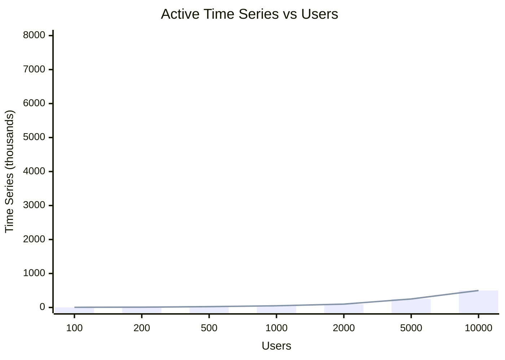
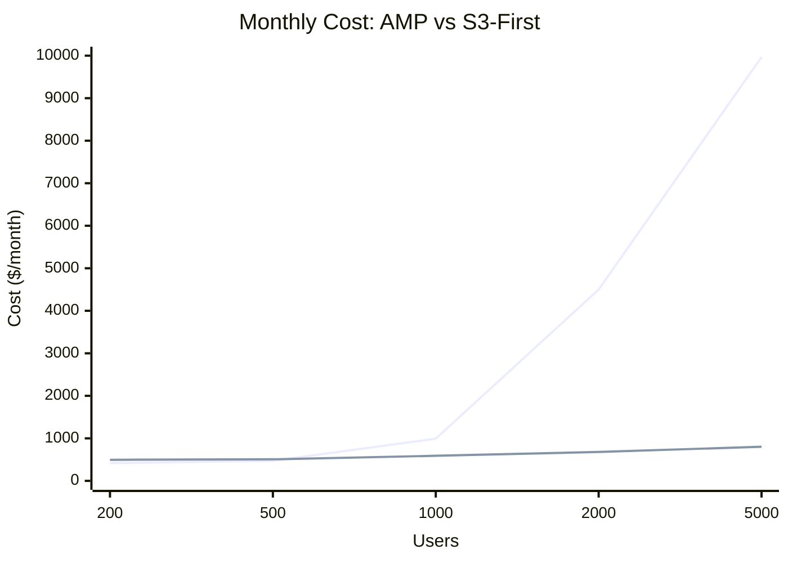
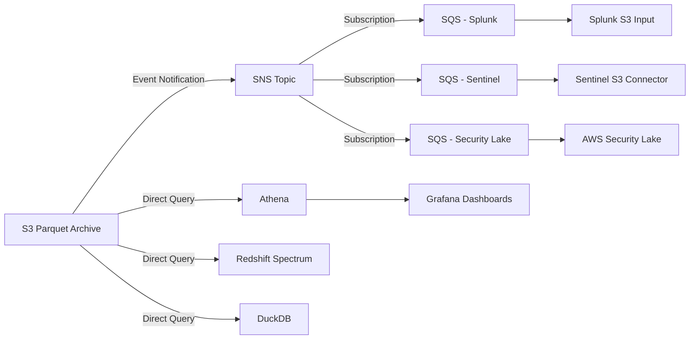

# Architecture Analysis — AMP vs S3-First

## Overview

This document compares Amazon Managed Prometheus (AMP) against the S3-First architecture (Kinesis → Firehose → S3 Parquet → Athena) for Claude Code telemetry at various scales.

---

## Cardinality Problem with AMP

Prometheus stores data as time series. Each unique combination of metric name + label values = one time series. Claude Code telemetry uses labels like `user_id`, `session_id`, `model`, `type`, `terminal_type`.

### Time Series Growth Formula

```
active_series = users × metrics × avg_label_combinations
stale_series = users × sessions_per_day × days × metrics
```

With `session_id` as a label, every new coding session creates time series that never get reused.

### Cardinality by Scale



| Users  | Active Series | Stale Series (30d) | Total Series | AMP Status     |
| ------ | ------------- | ------------------ | ------------ | -------------- |
| 100    | 5,000         | 15,000             | 20,000       | Healthy        |
| 200    | 10,000        | 30,000             | 40,000       | Healthy        |
| 500    | 25,000        | 75,000             | 100,000      | Degrading      |
| 1,000  | 50,000        | 150,000            | 200,000      | Slow queries   |
| 2,000  | 100,000       | 300,000            | 400,000      | Query timeouts |
| 5,000  | 250,000       | 750,000            | 1,000,000    | Unusable       |
| 10,000 | 500,000       | 1,500,000          | 2,000,000    | Unusable       |

### What Happens at Scale

- **< 500 users:** AMP works well. Queries sub-second. Cost minimal.
- **500-1,000 users:** Queries slow to 5-15 seconds. Dashboard refresh feels sluggish.
- **1,000-2,000 users:** Queries take 15-30 seconds. Grafana timeouts start occurring.
- **2,000+ users:** Most PromQL queries timeout at 30 seconds. Dashboards non-functional.
- **5,000+ users:** Query costs exceed $10,000/month. System effectively broken.

---

## Cost Comparison

### AMP Architecture Cost

| Component             | 200 Users | 500 Users | 1,000 Users | 5,000 Users |
| --------------------- | --------- | --------- | ----------- | ----------- |
| AMP Ingestion         | $1.30     | $3.25     | $6.50       | $32.50      |
| AMP Query             | $0.20     | $50       | $500        | $9,300      |
| AMP Storage           | $0.50     | $1.25     | $2.50       | $12.50      |
| Managed Grafana       | $250      | $250      | $250        | $250        |
| ECS Fargate (2 tasks) | $60       | $60       | $120        | $240        |
| ALB + WAF             | $30       | $35       | $40         | $60         |
| VPC Endpoints (5)     | $73       | $73       | $73         | $73         |
| **Total**             | **$415**  | **$472**  | **$992**    | **$9,968**  |

### S3-First Architecture Cost (Current)

| Component             | 200 Users | 500 Users | 1,000 Users | 5,000 Users |
| --------------------- | --------- | --------- | ----------- | ----------- |
| Kinesis (2 ON_DEMAND) | $15       | $15       | $20         | $40         |
| Firehose (2 streams)  | $0.50     | $1.25     | $2.50       | $12.50      |
| Lambda flatten        | $0.10     | $0.25     | $0.50       | $2.50       |
| S3 Storage            | $0.50     | $1.25     | $2.50       | $12.50      |
| Athena Queries        | $5        | $10       | $20         | $50         |
| Glue Catalog          | $0        | $0        | $0          | $0          |
| Managed Grafana       | $250      | $250      | $250        | $250        |
| ECS Fargate (2 tasks) | $60       | $60       | $120        | $240        |
| ALB + WAF             | $30       | $35       | $40         | $60         |
| VPC Endpoints (7)     | $102      | $102      | $102        | $102        |
| NAT Gateway           | $32       | $32       | $32         | $32         |
| **Total**             | **$495**  | **$507**  | **$590**    | **$802**    |

### Cost Comparison Chart



### Key Takeaway

- **< 300 users:** AMP is cheaper (~$80/month less)
- **300-500 users:** Roughly equal cost
- **500+ users:** S3-First becomes dramatically cheaper
- **5,000 users:** AMP costs 12x more ($9,968 vs $802)

The crossover point is approximately 300 users. Below that, AMP's simplicity and lower fixed costs win. Above that, AMP's query costs grow quadratically while S3-First grows linearly.

---

## Query Performance Comparison

| Metric              | AMP (200 users) | AMP (5,000 users) | S3-First (any scale) |
| ------------------- | --------------- | ----------------- | -------------------- |
| Simple aggregation  | < 1 sec         | 30+ sec (timeout) | 3-8 sec              |
| Per-user drill-down | 1-2 sec         | Impossible        | 3-8 sec              |
| 30-day trend        | 2-3 sec         | Impossible        | 5-10 sec             |
| Dashboard full load | 2-3 sec         | Non-functional    | 15-30 sec            |
| Data freshness      | ~10 sec         | ~10 sec           | ~5-7 min             |

The S3-First architecture has consistent query times regardless of user count. The tradeoff is higher baseline latency (3-8 sec vs sub-second) and 5-7 minute data freshness delay.

---

## Scalability Limits

| Factor                | AMP                           | S3-First                                   |
| --------------------- | ----------------------------- | ------------------------------------------ |
| Max users (practical) | ~500 with user_id labels      | Unlimited                                  |
| Max time series       | ~10M (soft limit)             | N/A — no time series concept               |
| Ingestion rate        | 70,000 samples/sec            | Kinesis ON_DEMAND auto-scales              |
| Query concurrency     | Limited by series count       | Limited by Athena concurrency (default 25) |
| Storage retention     | 150 days (default)            | 365 days (configurable, Glacier at 90d)    |
| Data format           | Prometheus TSDB (proprietary) | Parquet (open standard)                    |
| Schema flexibility    | Fixed at ingestion (labels)   | Flexible (Lambda transform)                |

---

## SIEM Integration

### AMP + SIEM

AMP stores data in Prometheus TSDB format, accessible only via PromQL. SIEM integration requires custom bridging:

| SIEM               | AMP Integration             | Difficulty                           |
| ------------------ | --------------------------- | ------------------------------------ |
| Splunk             | Custom Lambda: PromQL → HEC | High — build and maintain bridge     |
| Microsoft Sentinel | No native connector         | High — custom Logic App or Lambda    |
| QRadar             | No native connector         | High — custom DSM                    |
| AWS Security Hub   | No native integration       | Medium — custom EventBridge rules    |
| Elastic/OpenSearch | Prometheus remote read      | Medium — needs network access to AMP |

**Challenges:**

- No push mechanism — SIEM must poll AMP via PromQL
- PromQL is not SQL — SIEM query languages can't query AMP directly
- Network access — SIEM needs to reach AMP endpoint (VPC endpoint or public)
- No event notifications — no way to trigger SIEM ingestion on new data
- Data format mismatch — Prometheus samples ≠ SIEM events

### S3 Parquet + SIEM

S3 with Parquet is the industry standard for security data lakes. Most SIEMs have native or near-native S3 ingestion:

| SIEM               | S3 Parquet Integration               | Difficulty                |
| ------------------ | ------------------------------------ | ------------------------- |
| Splunk             | S3 input with SQS notifications      | Low — native connector    |
| Microsoft Sentinel | AWS S3 connector                     | Low — native connector    |
| QRadar             | S3 log source with SQS               | Low — native connector    |
| AWS Security Hub   | S3 → EventBridge → Security Hub      | Low — native AWS services |
| AWS Security Lake  | Native — OCSF Parquet format         | Lowest — same format      |
| Elastic/OpenSearch | S3 input plugin                      | Low — native connector    |
| Any SIEM           | S3 event notification → SQS → ingest | Low — standard pattern    |

**Advantages:**

- Push-based: S3 event notifications trigger SIEM ingestion automatically
- Standard format: Parquet is readable by every analytics tool
- SQL-queryable: Athena, Redshift Spectrum, Spark, DuckDB all read Parquet
- No custom bridges: SIEMs already know how to read from S3
- AWS Security Lake compatible: OCSF schema can be applied to Parquet
- Lake Formation: fine-grained access control for compliance
- Cross-account: S3 bucket policies enable multi-account SIEM architectures

### SIEM Integration Architecture (S3-First)



### SIEM Recommendation

For an enterprise deployment that needs SIEM integration:

1. **Add S3 event notifications** (SNS topic) when new Parquet files land
2. **Create SQS queues** per SIEM consumer
3. **Configure SIEM S3 connector** to read from the queue and pull Parquet files
4. **Use Lake Formation** for fine-grained access control (column-level, row-level)
5. **Consider OCSF schema mapping** if integrating with AWS Security Lake

This is a ~1 day implementation on top of the existing architecture. No changes to the data pipeline needed — just add notification and access layers on the S3 bucket.

---

## Summary

| Criteria          | AMP                               | S3-First (Current)                   |
| ----------------- | --------------------------------- | ------------------------------------ |
| Best for          | < 300 users, real-time dashboards | 300+ users, analytics, compliance    |
| Cost at scale     | Quadratic growth                  | Linear growth                        |
| Query speed       | Sub-second (small scale)          | 3-8 seconds (any scale)              |
| Data freshness    | ~10 seconds                       | ~5-7 minutes                         |
| SIEM integration  | Difficult (custom bridges)        | Native (S3 connectors)               |
| Data format       | Proprietary (TSDB)                | Open standard (Parquet)              |
| Retention         | 150 days                          | 365 days (configurable)              |
| Compliance/audit  | Limited                           | Full (S3 versioning, Lake Formation) |
| Cardinality limit | ~100K series practical            | Unlimited                            |
| Vendor lock-in    | AWS AMP + PromQL                  | Parquet readable by any tool         |
