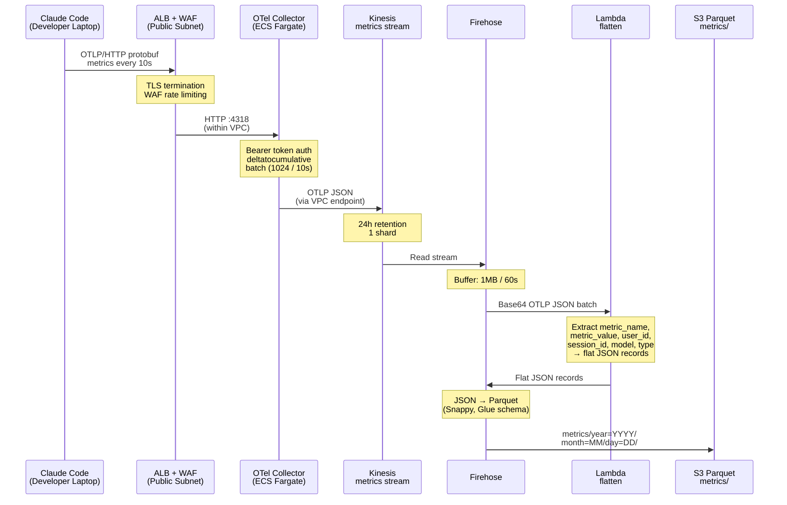
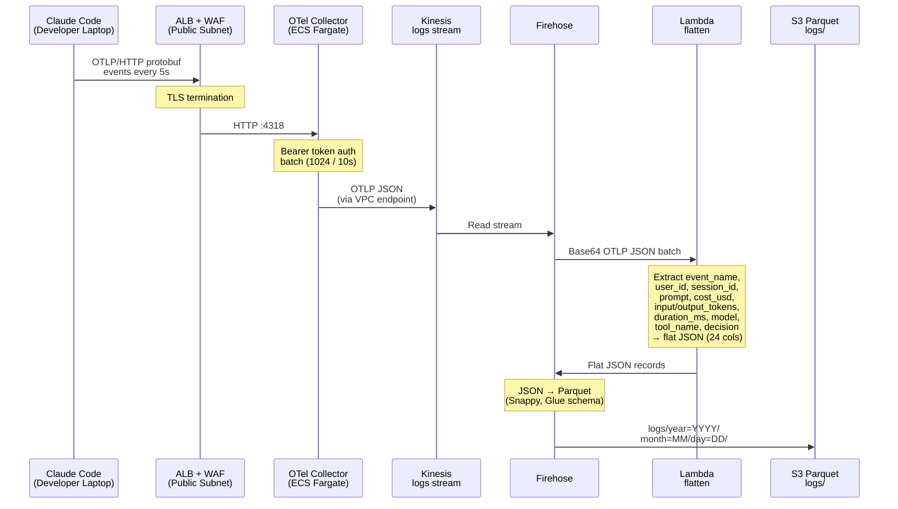
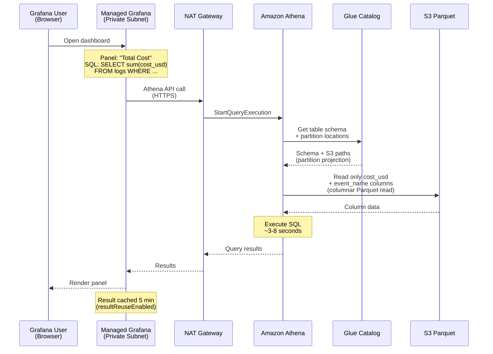
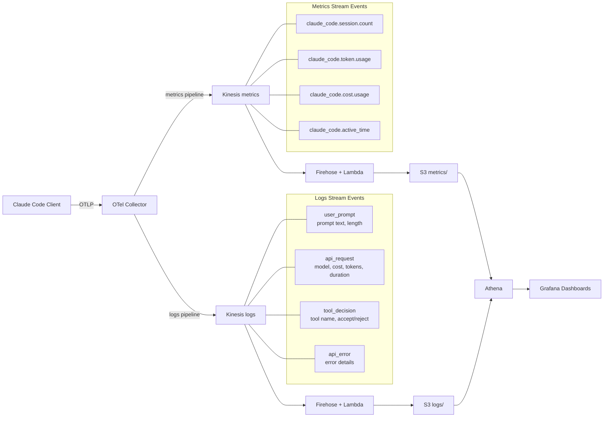

# Data Flow Diagrams

## Metrics Stream

```mermaid
sequenceDiagram
    participant Dev as Claude Code<br/>(Developer Laptop)
    participant ALB as ALB + WAF<br/>(Public Subnet)
    participant Col as OTel Collector<br/>(ECS Fargate)
    participant KM as Kinesis<br/>metrics stream
    participant FH as Firehose
    participant Lam as Lambda<br/>flatten
    participant S3 as S3 Parquet<br/>metrics/

    Dev->>ALB: OTLP/HTTP protobuf<br/>metrics every 10s
    Note over ALB: TLS termination<br/>WAF rate limiting
    ALB->>Col: HTTP :4318<br/>(within VPC)
    Note over Col: Bearer token auth<br/>deltatocumulative<br/>batch (1024 / 10s)
    Col->>KM: OTLP JSON<br/>(via VPC endpoint)
    Note over KM: 24h retention<br/>1 shard
    KM->>FH: Read stream
    Note over FH: Buffer: 1MB / 60s
    FH->>Lam: Base64 OTLP JSON batch
    Note over Lam: Extract metric_name,<br/>metric_value, user_id,<br/>session_id, model, type<br/>→ flat JSON records
    Lam->>FH: Flat JSON records
    Note over FH: JSON → Parquet<br/>(Snappy, Glue schema)
    FH->>S3: metrics/year=YYYY/<br/>month=MM/day=DD/
```

## Logs Stream

```mermaid
sequenceDiagram
    participant Dev as Claude Code<br/>(Developer Laptop)
    participant ALB as ALB + WAF<br/>(Public Subnet)
    participant Col as OTel Collector<br/>(ECS Fargate)
    participant KL as Kinesis<br/>logs stream
    participant FH as Firehose
    participant Lam as Lambda<br/>flatten
    participant S3 as S3 Parquet<br/>logs/

    Dev->>ALB: OTLP/HTTP protobuf<br/>events every 5s
    Note over ALB: TLS termination
    ALB->>Col: HTTP :4318
    Note over Col: Bearer token auth<br/>batch (1024 / 10s)
    Col->>KL: OTLP JSON<br/>(via VPC endpoint)
    KL->>FH: Read stream
    FH->>Lam: Base64 OTLP JSON batch
    Note over Lam: Extract event_name,<br/>user_id, session_id,<br/>prompt, cost_usd,<br/>input/output_tokens,<br/>duration_ms, model,<br/>tool_name, decision<br/>→ flat JSON (24 cols)
    Lam->>FH: Flat JSON records
    Note over FH: JSON → Parquet<br/>(Snappy, Glue schema)
    FH->>S3: logs/year=YYYY/<br/>month=MM/day=DD/
```

## Dashboard Query Flow

```mermaid
sequenceDiagram
    participant User as Grafana User<br/>(Browser)
    participant GF as Managed Grafana<br/>(Private Subnet)
    participant NAT as NAT Gateway
    participant ATH as Amazon Athena
    participant Glue as Glue Catalog
    participant S3 as S3 Parquet

    User->>GF: Open dashboard
    Note over GF: Panel: "Total Cost"<br/>SQL: SELECT sum(cost_usd)<br/>FROM logs WHERE ...
    GF->>NAT: Athena API call<br/>(HTTPS)
    NAT->>ATH: StartQueryExecution
    ATH->>Glue: Get table schema<br/>+ partition locations
    Glue-->>ATH: Schema + S3 paths<br/>(partition projection)
    ATH->>S3: Read only cost_usd<br/>+ event_name columns<br/>(columnar Parquet read)
    S3-->>ATH: Column data
    Note over ATH: Execute SQL<br/>~3-8 seconds
    ATH-->>NAT: Query results
    NAT-->>GF: Results
    GF-->>User: Render panel
    Note over GF: Result cached 5 min<br/>(resultReuseEnabled)
```

## Event Types in Each Stream

```mermaid
graph LR
    CC[Claude Code Client] -->|OTLP| COL[OTel Collector]

    COL -->|metrics pipeline| KM[Kinesis metrics]
    COL -->|logs pipeline| KL[Kinesis logs]

    subgraph "Metrics Stream Events"
        M1[claude_code.session.count]
        M2[claude_code.token.usage]
        M3[claude_code.cost.usage]
        M4[claude_code.active_time]
    end

    subgraph "Logs Stream Events"
        L1[user_prompt<br/>prompt text, length]
        L2[api_request<br/>model, cost, tokens, duration]
        L3[tool_decision<br/>tool name, accept/reject]
        L4[api_error<br/>error details]
    end

    KM --- M1 & M2 & M3 & M4
    KL --- L1 & L2 & L3 & L4

    KM --> FHM[Firehose + Lambda] --> S3M[S3 metrics/]
    KL --> FHL[Firehose + Lambda] --> S3L[S3 logs/]

    S3M --> ATH[Athena]
    S3L --> ATH
    ATH --> GF[Grafana Dashboards]
```

## End-to-End Latency

```mermaid
gantt
    title Data Latency: Prompt to Dashboard
    dateFormat ss
    axisFormat %S s

    section Collector
    OTel SDK batch           :a1, 00, 10s
    section Kinesis
    Stream buffer            :a2, after a1, 1s
    section Firehose
    Lambda buffer (60s)      :a3, after a2, 60s
    S3 delivery buffer (300s):a4, after a3, 300s
    section Query
    Athena query             :a5, after a4, 8s
```

Total: ~5-7 minutes from prompt to dashboard visibility.
